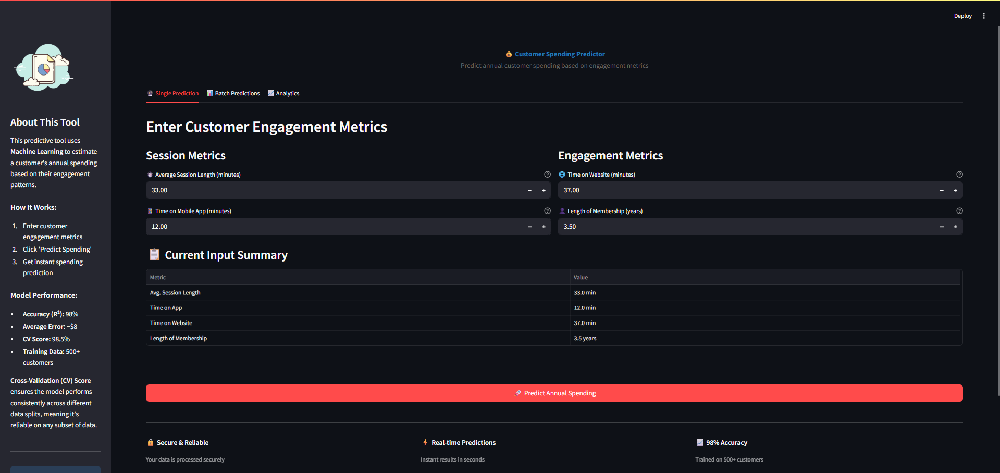
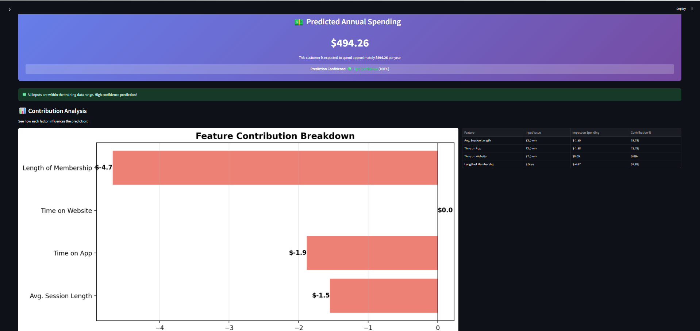
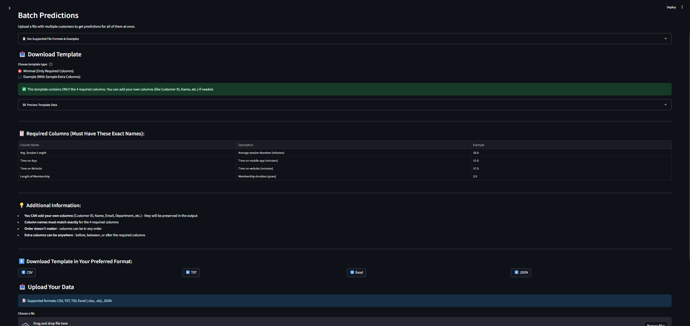
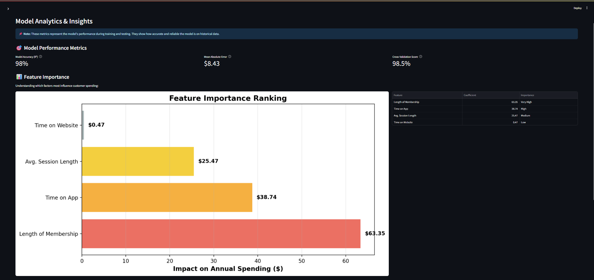

<div align="center">

# 💰 Ecommerce Customer Spending Predictor

### 🚀 Machine Learning-Powered Annual Spending Prediction

[](https://python.org)
[](https://streamlit.io)
[](https://scikit-learn.org)
[](https://pandas.pydata.org)

**Predict annual customer spending based on customer engagement metrics**  
*Linear Regression model trained on real ecommerce customer data*

[Overview](#overview) • [Features](#-features) • [Installation](#-installation) • [Usage](#-usage) • [Project Structure](#-project-structure)

</div>

---

## Overview

An interactive web application built with **Streamlit** that uses **Linear Regression** to predict how much customers will spend annually. This project demonstrates the end-to-end ML workflow: data preparation, model training, validation, and deployment through an intuitive interface.

The model is trained on the **Ecommerce Customers dataset**, containing customer engagement metrics like time spent on app, website visits, and membership length.

| Metric | Value |
|--------|-------|
| 📊 Model Type | Linear Regression |
| 🎯 Target Variable | Annual Spending ($) |
| 📈 R² Score | ~98% |
| ⚡ Prediction Speed | Real-time |

---

## 📸 Screenshots

### 🏠 Dashboard


*Model Dashboard and overview*

### 🔮 Single Prediction


*Real-time spending prediction interface*

### 📂 Batch Prediction


*Upload CSV and predict for multiple customers*

### 📊 Model Analytics


*Feature importance and model insights*

---

## ✨ Features

### 🔮 Spending Prediction

- ✅ Real-time annual spending predictions
- ✅ Pre-trained Linear Regression model with scaling
- ✅ Single customer prediction interface
- ✅ Batch prediction from CSV files

### 📊 Model Analytics

- ✅ Model performance metrics (R² score, MSE, MAE, RMSE)
- ✅ Feature importance and coefficient analysis
- ✅ Prediction accuracy visualization
- ✅ Model insights and interpretability
- ✅ Automatic column validation
- ✅ Scalable for real datasets

### 💾 Model Persistence

- ✅ Pre-trained joblib model
- ✅ Feature scaler for consistency
- ✅ Fast predictions without retraining
- ✅ Production-ready deployment

---

## 🚀 Installation

### Prerequisites

- Python 3.8 or higher
- pip (Python package manager)

### Quick Start

```bash
# Navigate to project directory
cd "d:\Machine learning\Linear-Regression-Projects\Ecommerce Project"

# Install dependencies
pip install -r requirements.txt.txt

# Run the application
streamlit run app/main.py
```

🌐 **Access the app at:** `http://localhost:8501`

---

## 📖 Usage

### 🏠 Dashboard (Home)

- View model performance metrics and accuracy
- See R² score and error metrics
- Get quick insights into model reliability

### 🔮 Single Prediction

Enter customer engagement metrics:

- 📱 **Avg. Session Length** (minutes)
- 📲 **Time on App** (minutes)
- 💻 **Time on Website** (minutes)
- 📅 **Length of Membership** (years)

Click **Predict** to get instant annual spending prediction

### 📂 Batch Prediction

1. Prepare CSV with required columns
2. Upload file through the interface
3. Get predictions for all customers
4. Download results for analysis

### 📊 Model Analytics

- View feature importance and coefficients
- Understand what drives customer spending
- Analyze model predictions vs actual values
- Visual feature impact analysis

---

## 📁 Project Structure

```
📦 Ecommerce Project
│
├── 📄 README.md                          # Project documentation
├── 📄 requirements.txt               # Python dependencies
│
├── 📂 app/
│   └── 🐍 main.py                       # Streamlit web application
│
├── 📂 data/
│   └── 📊 Ecommerce Customers.txt       # Training dataset
│
├── 📂 model/
│   ├── 🤖 linear_model.joblib           # Trained Linear Regression model
│   └── 🔧 scaler.joblib                 # Feature StandardScaler
│
├── 📂 notebook/
│   └── 📓 Ecommerce_linear_regression.ipynb  # Model training & analysis
│
└── 📂 screenshots/
    └── 📸 Project visualizations (optional)
```

---

## 📊 Dataset

The model is trained on the **Ecommerce Customers dataset** containing:

| Feature | Description |
|---------|-------------|
| `Avg. Session Length` | Average session duration in minutes |
| `Time on App` | Daily time spent on mobile app |
| `Time on Website` | Daily time spent on website |
| `Length of Membership` | Years as a member |
| `Yearly Amount Spent` | **Target variable** - Annual spending in $ |

**Data Source:** `data/Ecommerce Customers.txt`

---

## 🤖 Model Details

### Linear Regression Model

- **Algorithm:** Scikit-learn LinearRegression
- **Features:** 4 engagement metrics
- **Target:** Annual spending ($)
- **Performance:** R² ≈ 98%
- **Scaling:** StandardScaler normalization

### Model Files

- `model/linear_model.joblib` - Trained regression model
- `model/scaler.joblib` - Feature scaler for input normalization

---

## 🛠️ Technologies Used

| Technology | Purpose |
|-----------|---------|
| **Python** | Core programming language |
| **Streamlit** | Web application framework |
| **Scikit-learn** | Machine learning library |
| **Pandas** | Data manipulation & analysis |
| **NumPy** | Numerical computations |
| **Matplotlib & Seaborn** | Data visualization |
| **Joblib** | Model serialization |

---

## 📈 Results & Insights

The trained Linear Regression model achieves:

- **R² Score:** ~98% (explains 98% of variance)
- **Cross-Validation R² Score:** 98.48% (CV Mean R²: 0.9848)
- **Mean Absolute Error (MAE):** Very low prediction error
- **Fast Predictions:** Real-time inference on new data

### Key Insights

- Model provides highly accurate spending predictions
- Feature importance shows membership length drives most spending
- App/website engagement metrics are strong predictors
- Cross-validation ensures model generalizes well to unseen data

---

## 🧠 Notebook Analysis

Explore the full training pipeline in `notebook/Ecommerce_linear_regression.ipynb`:

- Data loading and exploration
- Feature scaling and normalization
- Model training with cross-validation
- Performance metrics and visualization
- Feature importance analysis

---

## 📝 Requirements

See `requirements.txt.txt` for all dependencies:

```
streamlit
numpy
pandas
scikit-learn
joblib
matplotlib
seaborn
```

---

## 💡 How to Run Locally

```bash
# 1. Navigate to project directory
cd "Ecommerce Project"

# 2. Install dependencies
pip install -r requirements.txt.txt

# 3. Run Streamlit app
streamlit run app/main.py

# 4. Open browser
# Navigate to http://localhost:8501
```

---

## 🔄 Workflow

```
Data (Ecommerce Customers.txt)
    ↓
Model Training (Jupyter Notebook)
    ↓
Model Export (linear_model.joblib, scaler.joblib)
    ↓
Streamlit App (app/main.py)
    ↓
User Predictions
```

---

## � Future Improvements

Potential enhancements for the project:

- 🤖 **Additional Regression Models** - Compare with Random Forest, XGBoost, SVR
- 📊 **Model Comparison Dashboard** - Side-by-side performance metrics
- 🔐 **User Authentication** - Secure login and user profiles
- 🗄️ **Database Integration** - Store predictions and user data
- ☁️ **Cloud Deployment** - Deploy on AWS/Azure/GCP
- 📑 **Automated Report Generation** - Export prediction reports as PDF

---

## �📝 License

Open Source Project - Feel free to use and modify as needed.

---

## 👤 Author

**Meet Bataviya**

Created as a Machine Learning project for ecommerce spending prediction.

[](https://www.linkedin.com/in/meet-bataviya/)

---

**⭐ If you found this helpful, please star the repository!**
