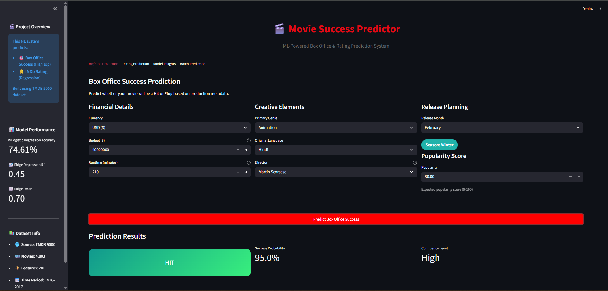
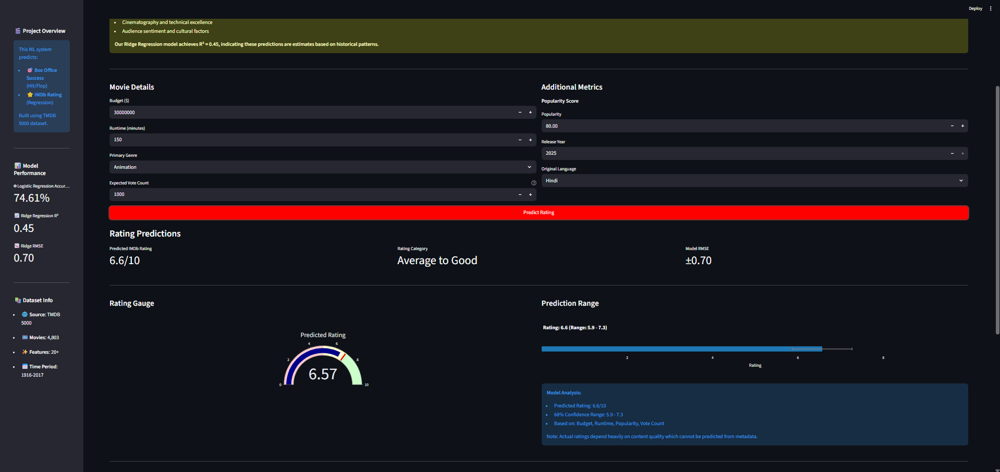
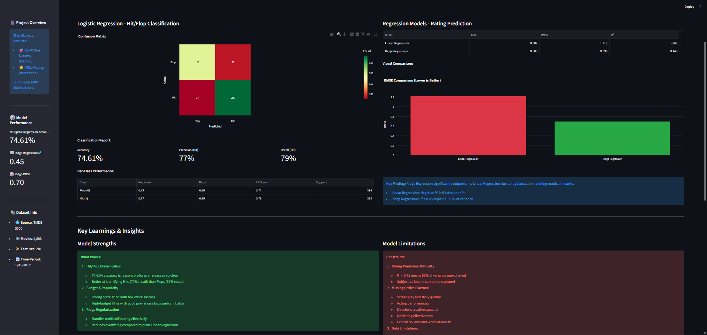

<div align="center">

# Movie Success Predictor

### Predict hit/flop and rating using machine learning

[](https://python.org)
[](https://streamlit.io)
[](https://scikit-learn.org)
[](https://pandas.pydata.org)

**Predict whether a movie is a hit or flop and estimate its rating**  
*Classification + regression models trained on TMDB data*

**Live App**: <https://logistic-regression-moviesucess.streamlit.app/>

[Overview](#-overview) • [Features](#-features) • [Screenshots](#-screenshots) • [Installation](#-installation) • [Usage](#-usage) • [Project Structure](#-project-structure) • [Dataset](#-dataset)

</div>

---

## Overview

An interactive **Streamlit** app that predicts movie success using a complete ML pipeline (data prep → feature engineering → modeling → deployment). The project supports:

- **Classification**: Hit/Flop prediction
- **Regression**: Rating prediction

### Key Highlights

| Aspect | Details |
|--------|---------|
| **Models** | Logistic Regression, Linear Regression, Ridge Regression |
| **Targets** | Success class, Movie rating |
| **Tools Used** | Scikit-learn, Pandas, NumPy, Matplotlib, Seaborn |
| **Deployment** | Streamlit Web App |
| **Inference** | Real-time predictions |

---

## Features

- **Hit/Flop Classification**: Predict movie success class
- **Rating Regression**: Estimate average rating score
- **Interactive UI**: Streamlit dashboard with clean inputs
- **Reusable Pipeline**: Saved preprocessing + model artifacts
- **Reproducible Workflow**: Notebooks for every step of the ML process

---

## 📸 Screenshots

### Hit/Flop Prediction Interface



### Rating Prediction Results



### Model Insights



---

## Installation

### Prerequisites

- Python 3.8 or higher
- pip package manager

### Steps

1. **Clone the repository**

   ```bash
   git clone <repository-url>
   cd "movie-success-predictor"
   ```

2. **Create a virtual environment** (recommended)

   ```bash
   python -m venv venv
   
   # On Windows
   venv\Scripts\activate
   
   # On macOS/Linux
   source venv/bin/activate
   ```

3. **Install dependencies**

   ```bash
   pip install -r requirements.txt
   ```

---

## Usage

### Running the Streamlit App

```bash
streamlit run app/streamlit_app.py
```

The app will open in your default browser at `http://localhost:8501`

### Making Predictions

1. Enter the movie details in the web interface
2. Click **Predict**
3. View the predicted success class and rating

### Exploring the Notebooks

```bash
jupyter notebook notebooks/
```

**Available Notebooks:**

- `01_data_exploration.ipynb` - Initial data exploration
- `02_data_cleaning.ipynb` - Data cleaning and preprocessing
- `03_eda.ipynb` - Exploratory data analysis
- `04_feature_engineering.ipynb` - Feature engineering
- `05_model_building.ipynb` - Model training and evaluation
- `06_logistic_regression.ipynb` - Classification focus
- `07_linear_regression.ipynb` - Regression focus

---

## 📁 Project Structure

```
movie-success-predictor/
│
├── README.md
├── requirements.txt
│
├── app/
│   └── streamlit_app.py
│
├── data/
│   ├── raw/
│   │   ├── tmdb_5000_credits.csv
│   │   └── tmdb_5000_movies.csv
│   └── processed/
│       ├── features_final.csv
│       ├── processed_movies.csv
│       ├── X_test.joblib
│       ├── X_train.joblib
│       ├── y_class_test.joblib
│       ├── y_class_train.joblib
│       ├── y_reg_test.joblib
│       └── y_reg_train.joblib
│
├── models/
│   ├── linear_model.joblib
│   ├── logistic_model.joblib
│   ├── ridge_model.joblib
│   └── preprocessor.joblib
│
├── notebooks/
│   ├── 01_data_exploration.ipynb
│   ├── 02_data_cleaning.ipynb
│   ├── 03_eda.ipynb
│   ├── 04_feature_engineering.ipynb
│   ├── 05_model_building.ipynb
│   ├── 06_logistic_regression.ipynb
│   └── 07_linear_regression.ipynb
│
└── screenshots/
    ├── dashboard.png
    ├── ratingprediction.png
    └── modelinsight.png
```

---

## Dataset

**Source**: TMDB 5000 Movie Dataset  
**Location**: `data/raw/`

### Description

The dataset contains movie metadata and credits used to engineer features for predicting success class and rating.

**Examples of Features:**

- Budget and revenue
- Runtime and release year
- Genre, cast, and crew metadata
- Popularity and vote statistics

---

## Technologies Used

- **Python 3.8+**
- **Streamlit**
- **Scikit-learn**
- **Pandas / NumPy**
- **Matplotlib / Seaborn**
- **Joblib**

---

## Future Enhancements

- [ ] Experiment with advanced models (Random Forest, XGBoost, Gradient Boosting)
- [ ] Add model explainability with SHAP/LIME
- [ ] Improve feature engineering (cast/crew embeddings, NLP on overviews)
- [ ] Build a REST API for predictions
- [ ] Add model monitoring and retraining pipeline

---

## Contributing

1. Fork the repository
2. Create a feature branch
3. Commit your changes
4. Open a Pull Request

---

## �📝 License

Open Source Project - Feel free to use and modify as needed.

---

## 👤 Author

**Meet Bataviya**

Created as a Machine Learning project for ecommerce spending prediction.

[](https://www.linkedin.com/in/meet-bataviya/)

---

**⭐ If you found this helpful, please star the repository!**
